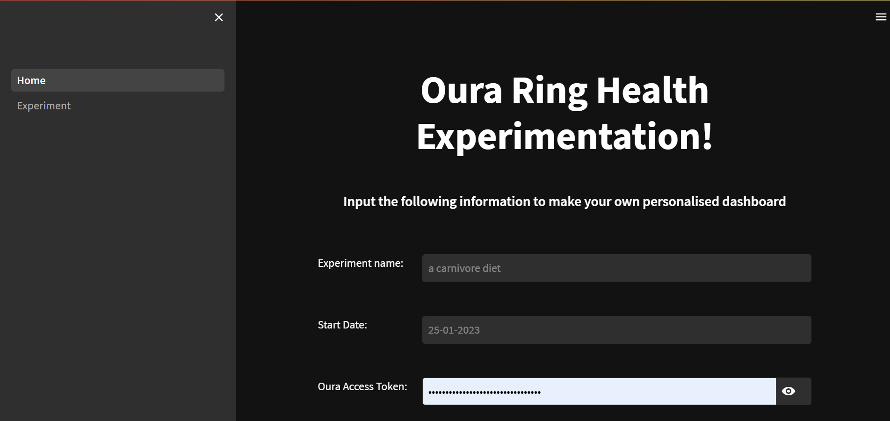
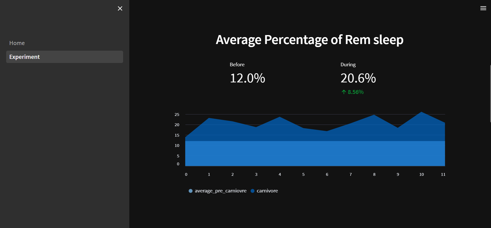

# Run metric driven Experiments on your health

## Requirements
An specified metric either manually entered or from an integration eg. oura ring or withings and the desire to make a lifestyle change and observe the output effects.

## How to use?
Follow the link to https://sophjones5-oura.streamlit.app/ and enter the required info on the landing page (Your oura access token can be retrieved via the link provided on the website).

Navigate to the dashboard via the side panel or button!

## Example
Below shows some screenshots of the website and resulting graphs based on a carnivore diet experiment I am running.

